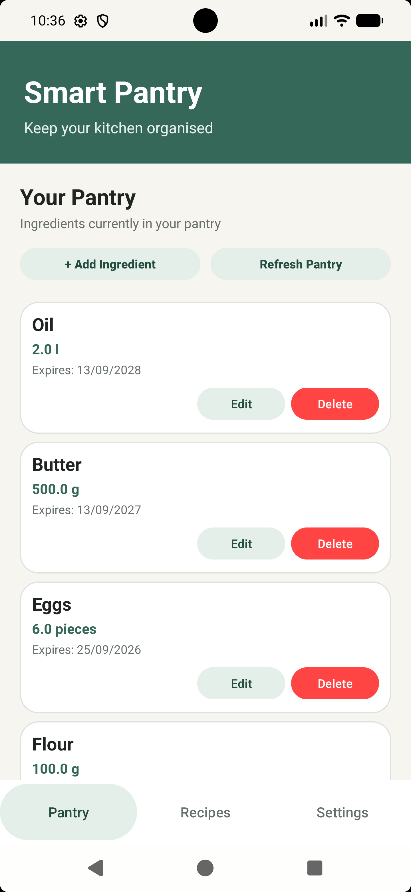
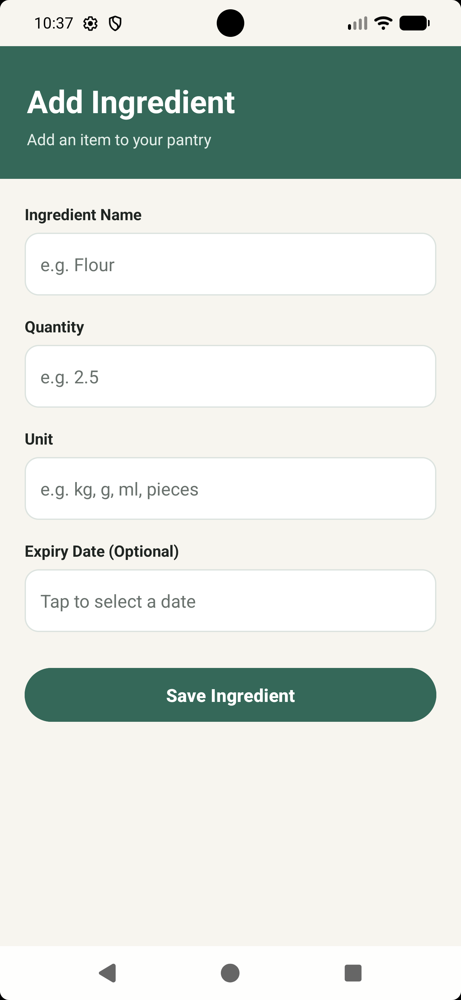
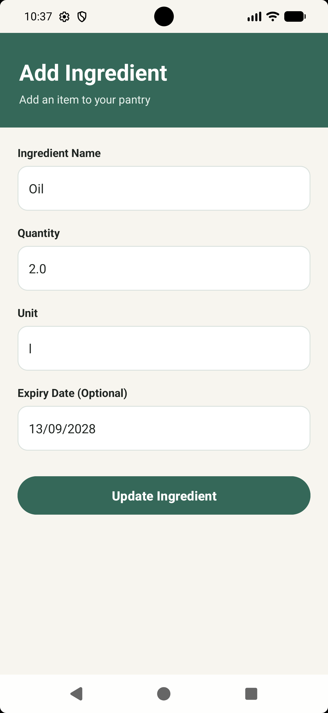
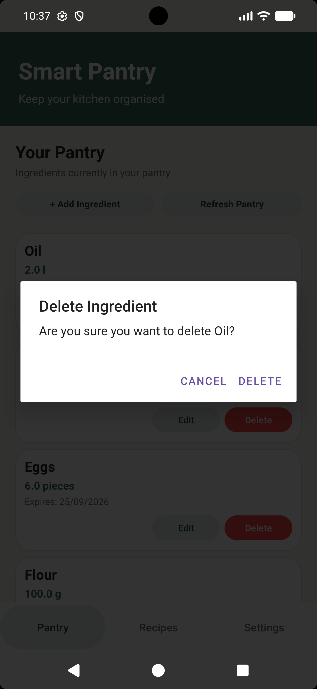
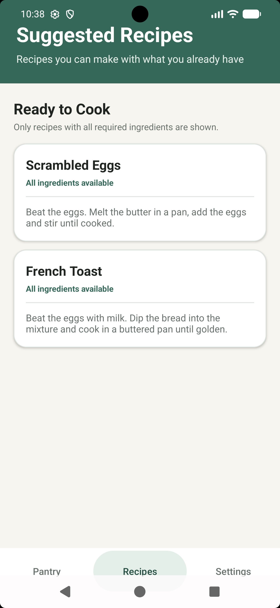
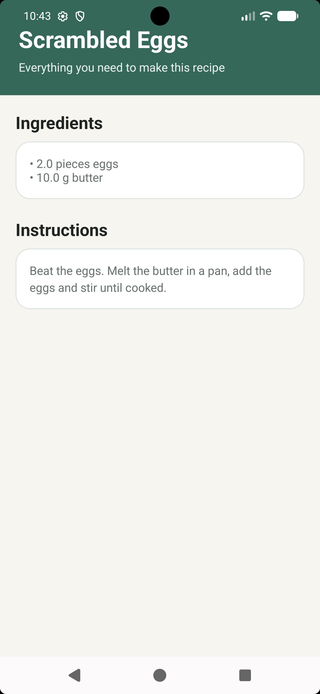
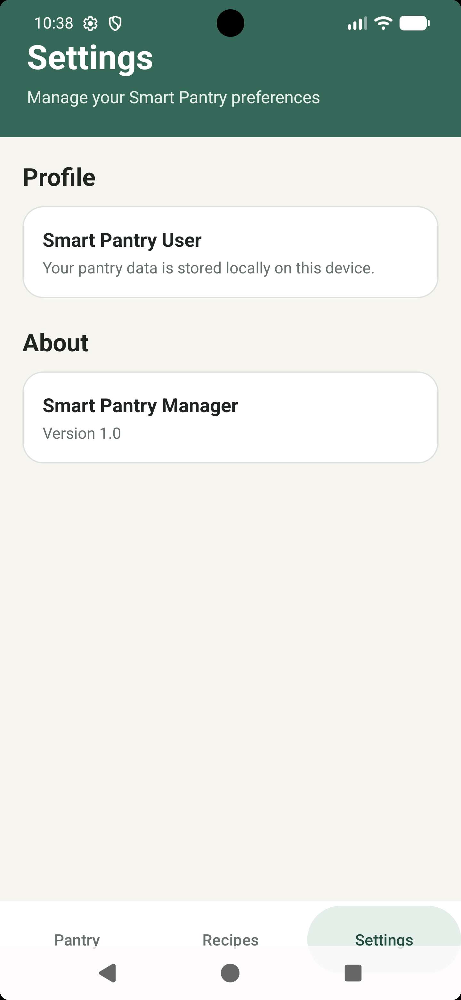

Smart Pantry Manager

Smart Pantry Manager is an Android application developed in Java that allows users to manage ingredients stored in their pantry and receive recipe suggestions based strictly on the ingredients they currently have available.

Application Features

1. Pantry Management
   Users can manage the ingredients currently available in their pantry.

This Smart Pantry Manager application supports:
- Adding new ingredients to the users' pantry
- Editing existing ingredients (eg, updating quantities, expiring dates, etc.)
- Deleting ingredients from their pantry
- Capture ingredient quantities and units
- Capture expiry dates(this is an optional option)
- Viewing all stored ingredients in their pantry
- Persistent ingredient storage using SQLite which enables the application to keep users ingredients, etc even when closing the application

2. Suggested Recipes
   Smart Pantry Manager suggests recipes based on the ingredients currently stored in the pantry.

A recipe is only displayed when:
- Every required ingredient is available
- The available quantity is sufficient
- The ingredient units are compatible

The matching system supports basic ingredient-name normalisation and unit conversion, including:
- Kilograms (kg) and grams (g)
- Litres (l) and millilitres (ml)
- Pieces
- Slices

Recipes with missing or insufficient ingredients are excluded from the suggested recipe list.

3. Recipe Details
   Users can select a suggested recipe to view:
- Recipe name
- Required ingredients and quantities
- Cooking instructions

4. Settings
   The application includes a Settings screen containing basic application and profile information.

Technologies Used

- Java
- Android Studio
- XML
- SQLite
- RecyclerView
- Android Activities
- Intents
- Git
- GitHub

Application Structure
The application consists of the following main screens:

1. Pantry – Displays ingredients currently stored in the pantry.
2. Add/Edit Ingredient – Allows ingredients to be added or updated.
3. Suggested Recipes – Displays recipes that can be made using the available pantry ingredients.
4. Recipe Detail – Displays the ingredients and instructions for a selected recipe.
5. Settings – Displays application and profile information.

Application Screenshots

1. Pantry Home Screen
The Pantry screen displays all ingredients currently stored by the user and provides access to pantry management functions.

2. Add Ingredient
Users can add a new ingredient by entering its name, quantity, unit, and optional expiry date.

3. Edit Ingredient
Existing pantry ingredients can be updated when quantities, units, or expiry dates change.

4. Delete Ingredient
Ingredients can be removed from the pantry using the delete functionality and confirmation dialog.

5. Suggested Recipes
Only recipes for which all required ingredients are available in sufficient quantities are displayed.

6. Recipe Detail
Selecting a suggested recipe displays its required ingredients and cooking instructions.

7. Settings
The Settings screen provides basic profile and application information.

Database
Smart Pantry Manager uses a local SQLite database.

The database contains three main tables:
1. pantry_items
   Stores the user's pantry ingredients, including:
- Ingredient name
- Quantity
- Unit
- Expiry date

2. recipes
   Stores recipe information, including:
- Recipe name
- Cooking instructions

3. recipe_ingredients
   Stores the ingredients and quantities required for each recipe.

The application seeds the database with a collection of recipes when it is first used.

Recipe Matching

The application uses strict recipe matching.
For a recipe to be suggested, all of its required ingredients must be present in the pantry in sufficient quantities.
For example, if a recipe requires:
- 150 g flour
- 200 ml milk
- 1 egg
  the recipe will only appear if the pantry contains enough of all three ingredients.
  The application also performs basic unit conversion. For example:
- 1 kg of flour can satisfy a requirement of 150 g.
- 1 litre of milk can satisfy a requirement of 200 ml.
  This prevents recipes from being suggested when the user does not have enough ingredients.

Validation

The Add/Edit Ingredient screen includes input validation to help maintain valid pantry data.
Validation includes:
- Ingredient name is required
- Quantity is required
- Quantity must be greater than zero
- Unit is required
- Invalid unit input is rejected
- Expiry dates can be selected using a date picker

Navigation

The application uses Activities and Intents for navigation.
The main navigation provides access to:
- Pantry
- Recipes
- Settings

Recipe cards can also be selected to open their corresponding Recipe Detail screen.

Running the Application

1. Clone or download the repository.
2. Open the project in Android Studio.
3. Allow Gradle to sync the project.
4. Start an Android emulator or connect an Android device.
5. Run the application using Android Studio.

Testing

The application was tested for:
- Adding ingredients
- Editing ingredients
- Deleting ingredients
- Input validation
- SQLite persistence
- Recipe matching
- Insufficient ingredient quantities
- Unit conversion
- Empty recipe results
- Recipe detail display
- Navigation between screens

Author: Venesia Swartz  

